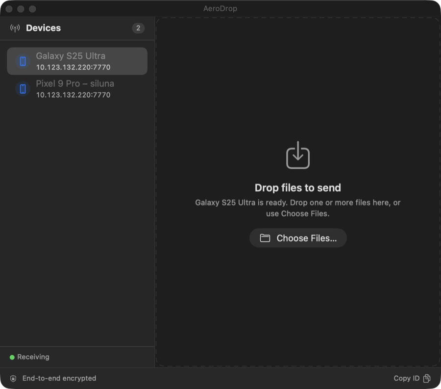

# AeroDrop for macOS

Peer-to-peer file transfer between a Mac and an Android device over the local
network. No cloud, no account, no internet connection required — the two
devices find each other over Bonjour and talk directly over TLS 1.3.

This repository is the **macOS app only**. The Android counterpart is a separate
project; this side is useless without it.



## Requirements

| | |
|---|---|
| macOS | 26.2 or later (deployment target) |
| Toolchain | Xcode 26+, Swift 5, C++20 |
| Dependencies | OpenSSL 3 (`brew install openssl@3`) |
| Network | Both devices on the same LAN, same subnet |
| Firewall | macOS will prompt to accept incoming connections on first launch |

The app is a **menu bar extra** — there is no Dock icon and no main window.
Click the antenna glyph in the menu bar to open the panel.

## Build

```bash
./xcode-setup.sh      # installs OpenSSL 3, generates AeroDrop.xcconfig
open AeroDrop.xcodeproj
```

Then in Xcode: select the project → target **AeroDrop** → *Info* →
*Configurations* → set **both** Debug and Release to the generated
`AeroDrop` xcconfig, then `⌘B`.

Or from the command line, once the xcconfig is wired up:

```bash
xcodebuild -scheme AeroDrop -configuration Debug build
```

> The project uses a file-system-synchronized group, so new files under
> `AeroDrop/` are picked up automatically — there is no "add files to target"
> step. Note that `xcode-setup.sh` still prints the older manual
> instructions, and its suggested `MACOSX_DEPLOYMENT_TARGET = 13.0` is stale;
> the project itself is set to 26.2.

## Using it

1. Open AeroDrop on both devices. The Mac starts advertising `_aerodrop._tcp`
   on port **7770** immediately at launch.
2. Your Android device appears in the **Devices** sidebar and is selected
   automatically. Click another row to switch.
3. Drop one or more files onto the panel, or press `⌘O` to pick them.

Transfers are **serialized through a queue** — drop twenty files and they go one
at a time, each with its own progress, throughput and time remaining. You can
keep dropping files while a transfer is running, remove anything still waiting,
and clear finished items when you're done. Received files land in
`~/Downloads/AeroDrop`.

The panel is resizable (drag the corner, or the title bar to move it) and
remembers its size. It opens by itself on first launch so the app isn't
mysteriously invisible, then stays out of the way.

### Pairing

There is no pairing step. Each device generates its own self-signed
certificate on first launch; the SHA-256 fingerprint is shown in the panel
footer and can be copied with **Copy ID**. Compare it out of band if you want
to confirm you're talking to the device you think you are.

## How it works

```
Android device                          Mac
     │                                     │
     ├── Bonjour _aerodrop._tcp:7770 ──────┤   AeroDiscoveryBrowser (NetServiceBrowser)
     │                                     │   BonjourService      (BonjourBridge.mm)
     │                                     │
     ├── TLS 1.3 ─────────────────────────►┤   AeroServer         (CXX, OpenSSL)
     ├── 64-byte AERO header               │   ├─ magic "AERO", version, file size,
     └── raw payload ──────────────────────┤   │  filename (44B), Adler-32
                                           │   └─ 512 KiB chunks
```

Discovery is deliberately **resolve-only**. `NetServiceBrowser` is used purely
to turn an mDNS name into an IP address; no TCP connection is opened during
discovery. An early `NWConnection` probe during discovery was enough to make
Android's `SSLServerSocket` throw and leave the Mac waiting forever, so the
browser never touches the socket.

Both devices bind an IPv6 dual-stack socket, so IPv4-mapped addresses work
without a second listener. When a peer advertises an IPv6 link-local address
the `%en0` scope ID is preserved so the kernel can route it.

### Wire format

A fixed 64-byte header precedes the payload:

| Offset | Size | Field |
|---|---|---|
| 0 | 4 | magic `AERO` |
| 4 | 4 | version (`uint32`, currently 1) |
| 8 | 8 | file size (`uint64`) |
| 16 | 44 | filename, UTF-8, null-padded |
| 60 | 4 | Adler-32 of the filename bytes |

The remainder of the connection is the raw file, streamed in 512 KiB chunks
with a progress callback every ~100 ms.

## Security

- TLS 1.3 only — `SSL_CTX_set_min_proto_version(TLS1_3_VERSION)`, so anything
  older is refused outright.
- Traffic is encrypted in transit and never leaves the LAN.
- **Certificates are not verified.** `SSL_VERIFY_NONE` is set on both the
  server and client contexts; the self-signed certificate is accepted as-is.
  That makes the channel confidential but **not authenticated** — a device on
  the same network could in principle man-in-the-middle it. This is trust-on-
  first-use with no automatic pinning, which is why the fingerprint is surfaced
  in the UI for manual comparison. Adding real verification (pinning on first
  contact, or a PAKE) is the obvious next step and is not implemented.

## Layout

```
AeroDrop/
  AeroDropApp.swift        App entry point; installs the status item
  Core/
    AeroDiscoveryBrowser   NetServiceBrowser wrapper → @Published [AeroPeerInfo]
    AeroPeerInfo           Peer model; id is the mDNS instance name
    BonjourService         @MainActor wrapper over the C registration API
    BonjourBridge.{h,mm}   DNSServiceRegister plumbing
    BridgeServer.{h,mm}    ObjC++ singleton owning AeroServer; block-based API
  CXX/
    AeroServer.{h,cpp}     TLS listener, inbound receive, outbound send
    CertManager.{h,cpp}    On-demand RSA-4096 keygen + self-signed cert
  UI/
    RootView               Two-pane layout, banner, security footer
    PeerSidebar            List-based device sidebar
    DropTargetView         Idle / drag-target state
    TransferQueueView      Queue summary and per-item rows
    TransferViewModel      Serialization, discovery wiring, throughput
    TransferItem           Queue item model + ThroughputMeter
    StatusPanelController  NSStatusItem + resizable AeroPanel
    Theme                  Colors, spacing, byte/duration formatting
```

SwiftUI for the UI, Objective-C++ as the bridge into the C++/OpenSSL
transport. There is no package manager dependency beyond OpenSSL; new files
under `AeroDrop/` join the target automatically.

### A note on throughput

`speed_mbps` in `AeroServer.h` is never assigned and is always `0.0`; the one
code path that did compute a rate reported MB/s, not Mbps. Rather than change
the transport, the UI derives throughput in Swift from byte deltas between
progress callbacks (`ThroughputMeter`), smoothed with an EWMA. The C++ field is
dead and could be removed.
